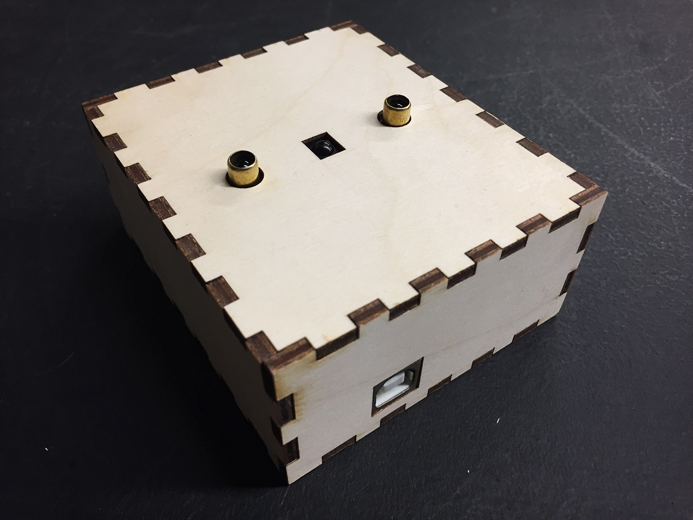

# ZX Gesture Sensor Box

Assets and software to create a self-contained ZX Gesture Sensor box with Arduino.

## Requirements

### Hardware

- [Arduino board](https://www.arduino.cc/)
- [ZX Gesture Sensor](https://www.sparkfun.com/products/13162)

### Software

- The [Arduino IDE](https://www.arduino.cc/en/Main/Software): This will allow to upload the source code provided in this repository to the board. An understanding of programming would also help.
- [Adobe Illustrator](https://www.adobe.com/ca/products/illustrator.html): At this time the lasercutting plans are saved in this format.

### Resources

- 1/8" plywood: The box plans have been made for this thickness of material. If you wish to make your own instead, take a look at the [MakerCase](http://www.makercase.com/) online tool.
- A lasercutter: There are many maker spaces and other similar services that offer this service nowadays. Do look around for them, and confirm with them how they need the diagrams to be adapted so that you can use the files provided in this repository.

## References

- [Arduino library for the XYZ GestureSense ZX sensor](https://github.com/sparkfun/SparkFun_ZX_Distance_and_Gesture_Sensor_Arduino_Library)
- [ZX Distance and Gesture Sensor Hookup Guide](https://learn.sparkfun.com/tutorials/zx-distance-and-gesture-sensor-hookup-guide)